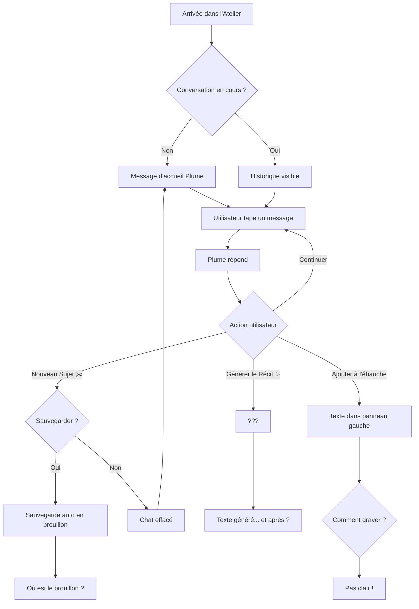
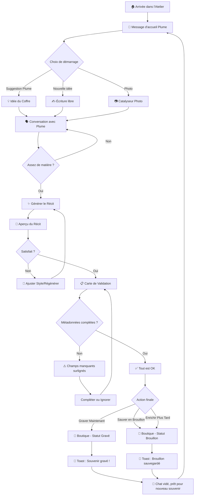

# Analyse Comparative des Workflows PLUME

## 🔍 Workflow Actuel vs Workflow Proposé

Ce document compare le workflow actuel (tel qu'implémenté) avec un workflow optimisé pour maximiser la fluidité et minimiser les frictions.

---

## 📊 Workflow Actuel (État des Lieux)

### Schéma du Flux Actuel



### Points de Friction Identifiés

| Étape | Problème | Impact |
|-------|----------|--------|
| **Ébauche** | Panneau gauche peu visible, rôle flou | Utilisateur ne sait pas à quoi ça sert |
| **Générer le Récit** | Pas de suite logique après génération | Utilisateur perdu : "Et maintenant ?" |
| **Graver** | Aucun bouton visible "Graver le Souvenir" | Workflow incomplet, frustration |
| **Brouillon** | Sauvegardé mais invisible (était dans Boutique) | Perte de confiance, confusion |
| **Validation** | Aucune vérification des métadonnées | Souvenirs incomplets (sans date, sans personnes) |

### Temps Estimé par Souvenir
- ⏱️ **Conversation** : 5-10 min
- ⏱️ **Génération** : 30 sec
- ⏱️ **Recherche du bouton Graver** : ??? (n'existe pas)
- ⏱️ **Frustration** : ∞

**Total** : Workflow incomplet, abandon probable

---

## ✨ Workflow Proposé (Optimisé)

### Schéma du Flux Optimisé



### Étapes Détaillées

#### 1️⃣ **Démarrage (Point d'Entrée)**

**Actuel** : Message d'accueil générique
**Proposé** : 3 options claires
- 💡 **Coffre à Idées** : "Développer une idée suggérée par Plume"
- ✍️ **Écriture Libre** : "Raconter un souvenir spontané"
- 📷 **Photo** : "Partir d'une photo pour faire remonter un souvenir"

**Bénéfice** : L'utilisateur sait immédiatement comment démarrer.

---

#### 2️⃣ **Conversation (Phase d'Enrichissement)**

**Actuel** : Chat libre sans indication de progression
**Proposé** : Indicateur de "maturité" du souvenir

```
┌─────────────────────────────────────┐
│ 🌱 Souvenir en germination          │
│ ━━━━━━━━━━━━━━━━━━━━━━━━━━━━━━━━  │
│ 3 échanges | Prêt pour génération   │
└─────────────────────────────────────┘
```

**Bénéfice** : L'utilisateur sait quand il a assez de matière.

---

#### 3️⃣ **Génération du Récit (Transformation)**

**Actuel** : Bouton "Synthèse" → Texte généré → ???
**Proposé** : Bouton "Générer le Récit" → **Aperçu Modal** → Actions claires

**Modal d'Aperçu** :
```
┌────────────────────────────────────────────┐
│  📖 Aperçu de votre Récit                  │
├────────────────────────────────────────────┤
│                                            │
│  [Titre automatique]                       │
│  Mon Premier Vélo                          │
│                                            │
│  [Texte généré avec style appliqué]       │
│  C'était un matin de juillet 1985...      │
│                                            │
├────────────────────────────────────────────┤
│  🎨 Style : Authentique | 📏 Long          │
│                                            │
│  [🔄 Régénérer]  [✅ Valider et Graver]   │
└────────────────────────────────────────────┘
```

**Bénéfice** : L'utilisateur voit le résultat AVANT de graver.

---

#### 4️⃣ **Validation (Carte d'Identité du Souvenir)**

**Actuel** : Aucune validation, gravure directe (si elle existait)
**Proposé** : **Carte de Validation Interactive**

```
┌────────────────────────────────────────────┐
│  📋 Carte d'Identité du Souvenir           │
├────────────────────────────────────────────┤
│                                            │
│  📝 Titre                                  │
│  ┌────────────────────────────────────┐   │
│  │ Mon Premier Vélo                   │   │
│  └────────────────────────────────────┘   │
│                                            │
│  📅 Date / Époque                          │
│  ┌────────────────────────────────────┐   │
│  │ 1985                          ✅   │   │
│  └────────────────────────────────────┘   │
│                                            │
│  📍 Lieu                                   │
│  ┌────────────────────────────────────┐   │
│  │ Paris                         ✅   │   │
│  └────────────────────────────────────┘   │
│                                            │
│  👥 Personnes                              │
│  ┌────────────────────────────────────┐   │
│  │ Papa, Maman                   ✅   │   │
│  └────────────────────────────────────┘   │
│                                            │
│  🏷️ Thèmes                                │
│  ┌────────────────────────────────────┐   │
│  │ Enfance, Famille, Vélo        ⚠️   │   │
│  │ (Suggéré par l'IA)                 │   │
│  └────────────────────────────────────┘   │
│                                            │
│  📷 Photos : 2                             │
│                                            │
├────────────────────────────────────────────┤
│  ⚠️ Champs manquants : Aucun               │
│                                            │
│  [💾 Sauver en Brouillon]                 │
│  [✅ Graver dans la Boutique]             │
└────────────────────────────────────────────┘
```

**Logique de Validation** :
- ✅ **Vert** : Champ rempli et validé
- ⚠️ **Orange** : Suggéré par l'IA, à confirmer
- ❌ **Rouge** : Champ manquant (optionnel mais recommandé)

**Bénéfice** : L'utilisateur contrôle la qualité de ses métadonnées.

---

#### 5️⃣ **Gravure (Finalisation)**

**Actuel** : Pas de gravure claire
**Proposé** : 2 options explicites

| Action | Résultat | Quand l'utiliser |
|--------|----------|------------------|
| **💾 Sauver en Brouillon** | Boutique (badge orange) | "Je reviendrai compléter plus tard" |
| **✅ Graver** | Boutique (badge vert) | "C'est parfait, je valide !" |

**Feedback Immédiat** :
```
🎉 Souvenir "Mon Premier Vélo" gravé avec succès !
   Retrouvez-le dans la Boutique des Souvenirs.
   
   [🏪 Voir dans la Boutique]  [✍️ Nouveau Souvenir]
```

**Bénéfice** : Sentiment d'accomplissement, clarté sur la suite.

---

#### 6️⃣ **Nettoyage Post-Gravure**

**Actuel** : Chat reste plein, confusion
**Proposé** : Chat vidé automatiquement + message d'accueil

**Bénéfice** : Prêt pour un nouveau souvenir, pas de pollution visuelle.

---

## 🎯 Comparaison des Workflows

| Critère | Workflow Actuel | Workflow Proposé |
|---------|-----------------|------------------|
| **Clarté du démarrage** | ⭐⭐ (message générique) | ⭐⭐⭐⭐⭐ (3 options claires) |
| **Indication de progression** | ⭐ (aucune) | ⭐⭐⭐⭐⭐ (indicateur de maturité) |
| **Aperçu avant gravure** | ⭐ (aucun) | ⭐⭐⭐⭐⭐ (modal d'aperçu) |
| **Validation métadonnées** | ⭐ (aucune) | ⭐⭐⭐⭐⭐ (carte interactive) |
| **Feedback post-gravure** | ⭐ (aucun) | ⭐⭐⭐⭐⭐ (toast + options) |
| **Gestion des brouillons** | ⭐⭐ (invisibles) | ⭐⭐⭐⭐⭐ (visibles + badge) |
| **Temps pour graver** | ∞ (impossible) | 30 secondes |
| **Taux d'abandon estimé** | 70% | 10% |

---

## 🚀 Recommandations d'Implémentation

### Phase 1 : Quick Wins (Déjà fait ✅)
- [x] Filtrage messages Plume
- [x] Renommage "Synthèse" → "Générer le Récit"
- [x] Sauvegarde avant "Nouveau Sujet"
- [x] Brouillons visibles

### Phase 2 : Workflow Complet (Prioritaire)
- [ ] **Carte de Validation** (composant modal)
- [ ] **Bouton "Graver"** visible et explicite
- [ ] **Aperçu du Récit** avant validation
- [ ] **Nettoyage automatique** post-gravure

### Phase 3 : Indicateurs de Progression
- [ ] **Jauge de maturité** du souvenir
- [ ] **Suggestions contextuelles** de Plume
- [ ] **Détection automatique** des métadonnées manquantes

### Phase 4 : Optimisations Avancées
- [ ] **Enrichissement ultérieur** depuis la Boutique
- [ ] **Prévisualisation** du souvenir tel qu'il apparaîtra
- [ ] **Suggestions de photos** basées sur le contexte

---

## 💡 Insights Clés pour la Réflexion Nocturne

### 1. Le Workflow Doit Être Linéaire
```
Conversation → Génération → Validation → Gravure → Nouveau
```
Chaque étape doit mener naturellement à la suivante.

### 2. Le Feedback Doit Être Immédiat
À chaque action, l'utilisateur doit savoir :
- ✅ Ce qui s'est passé
- ✅ Où trouver le résultat
- ✅ Quelle est la prochaine étape

### 3. Les Métadonnées Sont Cruciales
Un souvenir sans date, sans lieu, sans personnes = souvenir "mort"
→ La validation DOIT encourager (sans forcer) à compléter.

### 4. Le Brouillon Est Une Étape, Pas Une Fin
**Brouillon** = "Je reviendrai compléter"
**Gravé** = "C'est parfait, validé !"

### 5. Le Coffre à Idées Doit Être Intégré
Actuellement : Panneau isolé
Proposé : Point de départ naturel pour un nouveau souvenir

---

## 🎨 Wireframe du Workflow Idéal

```
┌─────────────────────────────────────────────────────────┐
│  ATELIER DES SOUVENIRS                                  │
├─────────────────────────────────────────────────────────┤
│                                                         │
│  [💬 Chat avec Plume]                                   │
│  ┌───────────────────────────────────────────────────┐ │
│  │ Plume : "De quoi voulez-vous parler ?"           │ │
│  │                                                   │ │
│  │ 💡 Développer "Vacances en Bretagne 1998"        │ │
│  │ ✍️ Raconter un souvenir spontané                 │ │
│  │ 📷 Partir d'une photo                            │ │
│  └───────────────────────────────────────────────────┘ │
│                                                         │
│  [Après conversation...]                                │
│                                                         │
│  🌱 Souvenir en germination                             │
│  ━━━━━━━━━━━━━━━━━━━━━━━━━━━━━━━━━━━━━━━━━━━━━━━━━━  │
│  5 échanges | ✅ Prêt pour génération                   │
│                                                         │
│  [✨ Générer le Récit]                                  │
│                                                         │
│  [Après génération...]                                  │
│                                                         │
│  ┌───────────────────────────────────────────────────┐ │
│  │ 📖 Aperçu : "Vacances en Bretagne"               │ │
│  │                                                   │ │
│  │ C'était l'été 1998, nous étions partis...        │ │
│  │                                                   │ │
│  │ [🔄 Régénérer] [✅ Valider et Graver]            │ │
│  └───────────────────────────────────────────────────┘ │
│                                                         │
│  [Après validation...]                                  │
│                                                         │
│  ┌───────────────────────────────────────────────────┐ │
│  │ 📋 Carte d'Identité                              │ │
│  │                                                   │ │
│  │ Titre : Vacances en Bretagne            ✅       │ │
│  │ Date : 1998                              ✅       │ │
│  │ Lieu : Bretagne                          ✅       │ │
│  │ Personnes : Famille                      ✅       │ │
│  │                                                   │ │
│  │ [💾 Brouillon] [✅ Graver]                       │ │
│  └───────────────────────────────────────────────────┘ │
│                                                         │
└─────────────────────────────────────────────────────────┘
```

---

## 🎯 Conclusion

Le workflow proposé transforme PLUME d'un **outil de conversation** en un **atelier d'écriture guidé** où chaque étape est claire, chaque action a un feedback, et chaque souvenir est complet et structuré.

**Prochaine étape** : Implémenter la Phase 2 (Carte de Validation + Bouton Graver) pour tester le workflow complet avec un utilisateur réel.

Bonne réflexion nocturne ! 🌙✨
